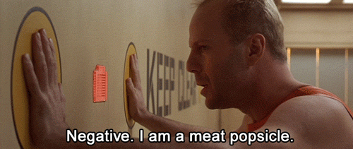

# Many websites ask me:
🤖 `ARE YOU HUMAN?`

## Most repositories are private.

If you are a prospective client/employer, I recommend against using this profile as a reflection of my ability/experience/portfolio.

Profile picture: 'Ian' by [Matt Boucher](https://opensea.io/TheMindsEye)
<!--
**ianrandmckenzie/ianrandmckenzie** is a ✨ _special_ ✨ repository because its `README.md` (this file) appears on your GitHub profile.

Here are some ideas to get you started:

- 🔭 I’m currently working on ...
- 🌱 I’m currently learning ...
- 👯 I’m looking to collaborate on ...
- 🤔 I’m looking for help with ...
- 💬 Ask me about ...
- 📫 How to reach me: ...
- 😄 Pronouns: ...
- ⚡ Fun fact: ...
-->
